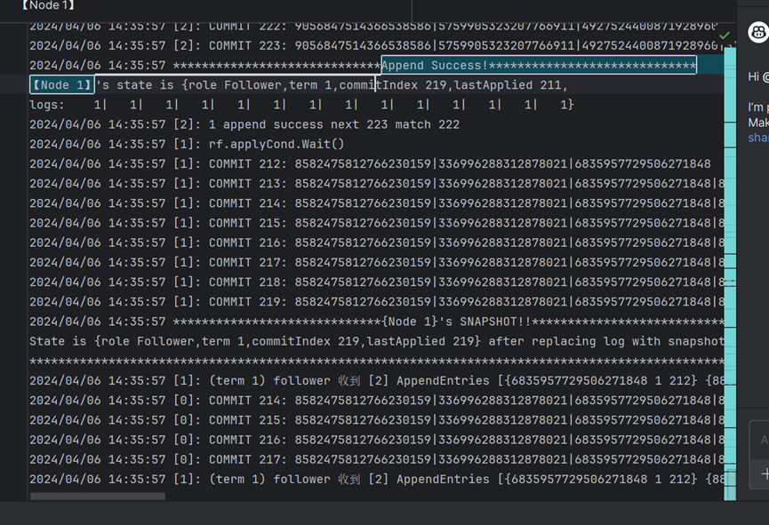
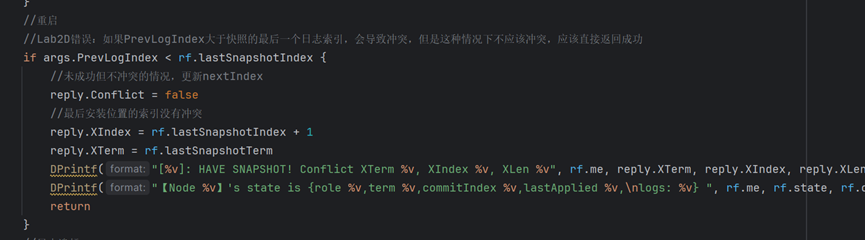
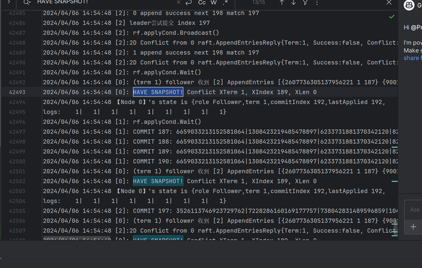
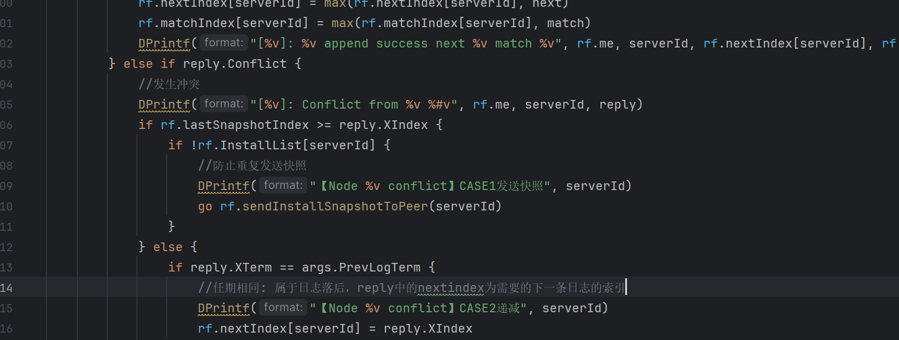
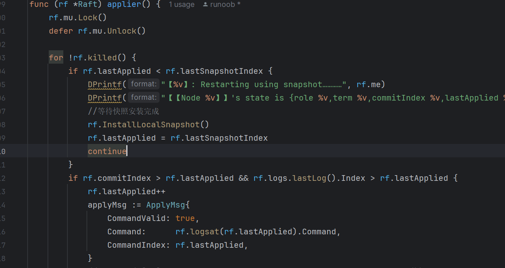
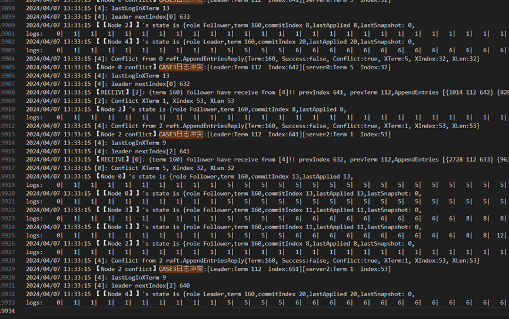
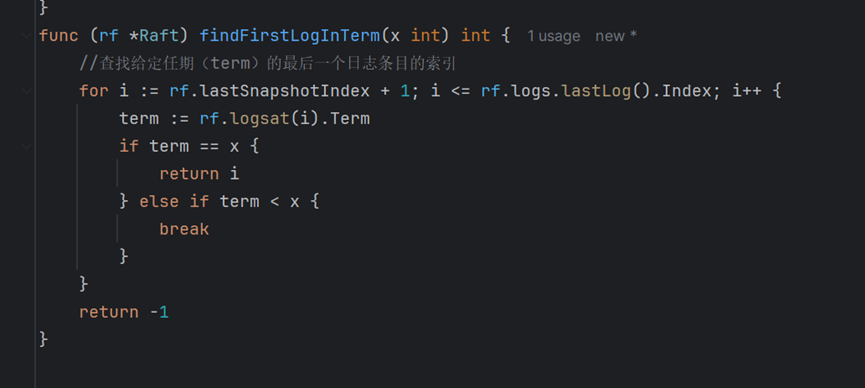

# MIT6.824 Labs

## Lab2 Raft

### 100 次测试通过

- PASS
- ok 6.824/raft 354.681s

### 问题一：加入快照后的并发问题

前三个根据图 2 写的比较简单，当写 2D 时，前面的逻辑都要改，很痛苦！

1. 接收成功，并记录快照后舍弃 219 后的日志
2. 还没更新，就又发送了一个 `appendentry`，导致越界。`AppendEntry` 内部锁了，但是 leader 的发送没锁。

   

### 解决方法：

在 Follower receive `appendentry` 的时候加入判定，如果已有更新的快照版本，则返回 rf.lastSnapshotIndex + 1 作为下一条需要的日志

### 问题二：持久化后，followers 的 `nextindex` 已在磁盘？

解决方法：在接收到 reply 后判断 xindex 和 lastsnapshot 之间的关系，如果小于则发送快照

### 问题三：加入 SnapShot 后，测试时日志数量错误

测试时报错：预期有 100 个 index，却出现 104 个。原因：

这个错误信息表示服务器 0 在应用日志时出现了顺序错误。它期望应用的日志索引为 100，但实际上得到的日志索引为 104。
这可能是因为在服务器崩溃并恢复后，它没有正确地从快照中恢复其状态，导致它试图跳过一些日志条目并直接应用索引为 104 的日志。

#### 解决思路

- 确保在服务器崩溃后，你正确地从快照中恢复了服务器的状态。这包括恢复 `lastApplied` 和 `commitIndex` 的值，以及恢复日志数组。
- 确保在应用日志之前，你已经检查了日志的索引是否与 `lastApplied` 相等。如果不相等，那么你可能需要跳过一些日志条目，直到找到一个索引与 `lastApplied` 相等的日志条目。
- 确保你在应用日志之后，正确地更新了 `lastApplied` 的值。你应该将 `lastApplied` 设置为刚刚应用的日志的索引。

解决方法：
每次 apply 前检查 lastapplied 和快照版本的关系，如果版本落后则安装本地的快照

- Tips：在持久化中未保存 rf.lastApplied 的状态，因为 rf.lastApplied 只能在 applier 函数中递增或者从快照中获得
- 本项目中用“rf.lastApplied = rf.lastSnapshotIndex”代替 apply 追赶的过程，实际工程中应根据磁盘中的日志文件（wal）进行追赶

### 问题 4：6.824 的持久化方式太粗暴

目前持久化方式为，每次发生一些变动就要把所有的状态都编码持久化一遍，这显然是生产不可用的。对 I/O 耗时、网络带宽压力都很大。解决方法：生产环境中，至少对于 raft 日志，应该是通过一个类似于 WAL 的方式来顺序写磁盘。

#### 构想可能的解决方法：

系统中的服务器使用 WAL，把执行操作的日志存储到磁盘中。Leader 会定期进行快照并将快照持久化，快照中包含内存中的状态、磁盘中已成功提交的日志。Leader 定期将日志快照发送给 follower，如果 follower 发现自己的日志版本低于快照，则进行快照安装和日志追赶。数据的快照本地存储，不通过网络传播，数据快照记录最后一条应用成功的日志编号，和 WAL 的日志序列比对。

### 问题 5：日志冲突靠递减恢复太慢

解决方法：

发生冲突时，将 `nextindex` 改为冲突日志任期的第一个日志。

## Lab3 KVRaft

## Lab4 ShardedKV
